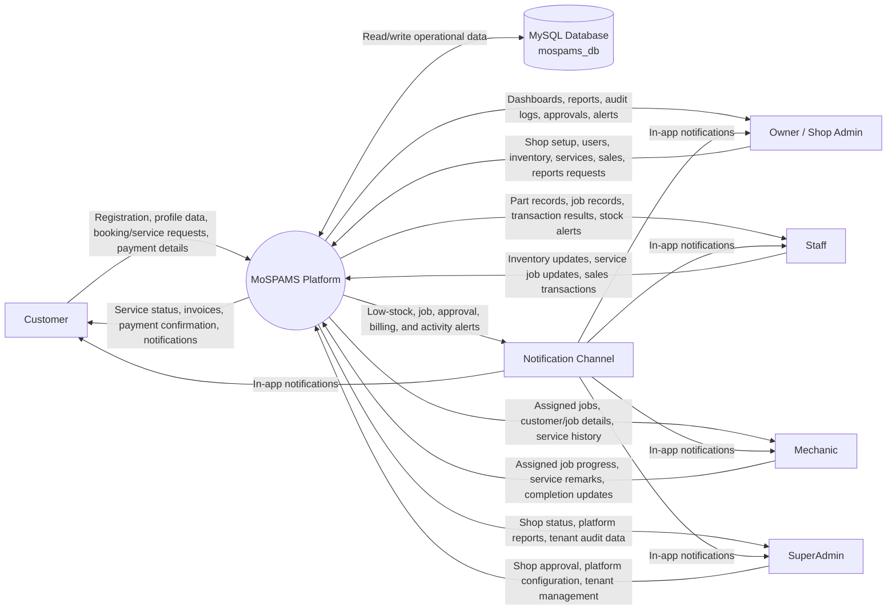
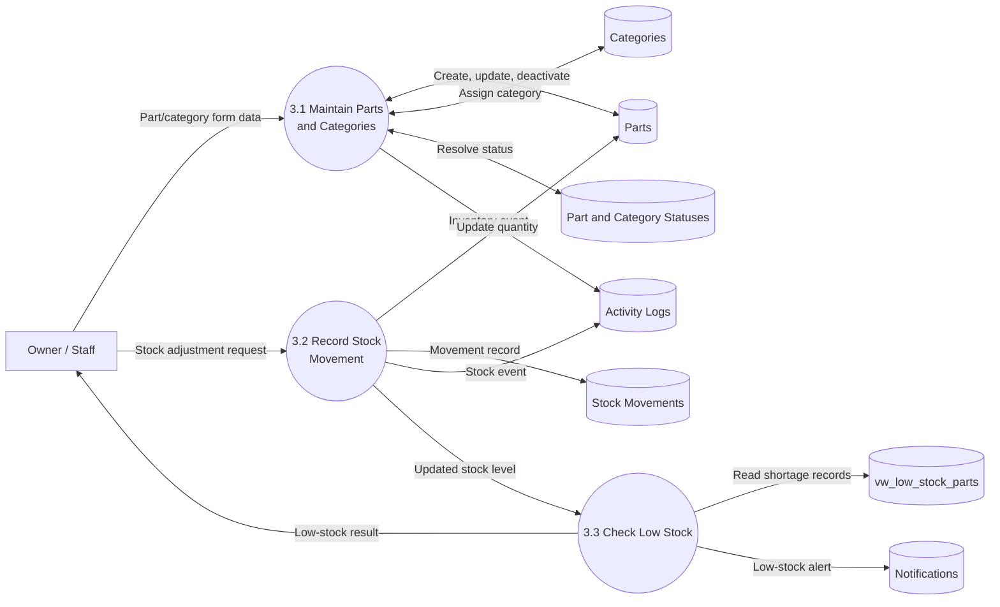
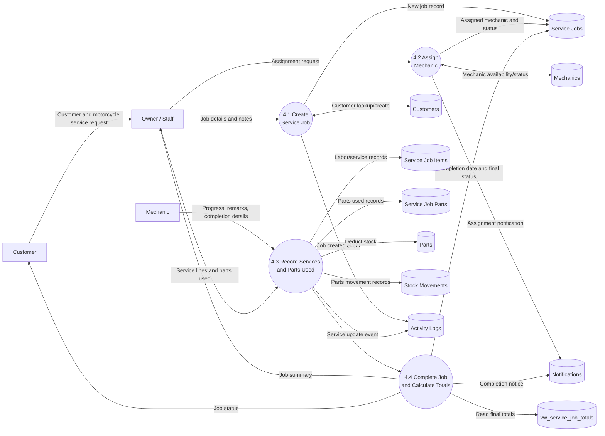
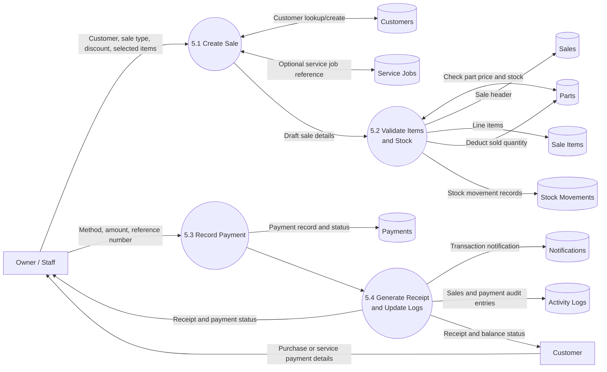

# MoSPAMS Data Flow Diagram

MoSPAMS is a multi-tenant Motorcycle Service and Parts Management System. This DFD describes how external users, the React frontend, the Laravel API, and the MySQL database exchange data for shop operations such as authentication, inventory, service jobs, sales, payments, reports, notifications, and audit logs.

## Level 0 - Context Diagram

## Level 1 - Major Processes

```mermaid
flowchart TB
    customer[Customer]
    owner[Owner / Shop Admin]
    staff[Staff]
    mechanic[Mechanic]
    superadmin[SuperAdmin]

    frontend[React + TypeScript Frontend]

    p1((1.0 Authentication<br/>and Tenant Access))
    p2((2.0 Shop and User<br/>Administration))
    p3((3.0 Inventory<br/>Management))
    p4((4.0 Service Job<br/>Management))
    p5((5.0 Sales and<br/>Payment Processing))
    p6((6.0 Reports and<br/>Dashboards))
    p7((7.0 Notifications<br/>and Activity Logging))

    d1[(D1 Users, Roles,<br/>User Statuses)]
    d2[(D2 Shops and<br/>Tenant Settings)]
    d3[(D3 Customers<br/>and Mechanics)]
    d4[(D4 Parts, Categories,<br/>Statuses)]
    d5[(D5 Service Jobs,<br/>Items, Job Parts)]
    d6[(D6 Sales, Sale Items,<br/>Payments)]
    d7[(D7 Stock Movements)]
    d8[(D8 Notifications)]
    d9[(D9 Activity Logs)]
    d10[(D10 Reporting Views<br/>vw_low_stock_parts,<br/>vw_service_job_totals)]

    customer -->|Credentials, profile updates, requests| frontend
    owner -->|Admin actions and reports requests| frontend
    staff -->|Inventory, service, sales actions| frontend
    mechanic -->|Job progress and remarks| frontend
    superadmin -->|Platform and tenant actions| frontend

    frontend -->|API requests| p1
    frontend -->|Authenticated API requests| p2
    frontend -->|Authenticated API requests| p3
    frontend -->|Authenticated API requests| p4
    frontend -->|Authenticated API requests| p5
    frontend -->|Authenticated API requests| p6

    p1 <-->|Login, registration, role, shop context| d1
    p1 <-->|Tenant resolution and shop status| d2
    p1 -->|Auth token, role permissions, shop context| frontend

    p2 <-->|User and role maintenance| d1
    p2 <-->|Shop approval, activation, suspension, branding| d2
    p2 <-->|Customer and mechanic records| d3
    p2 -->|Administration results| frontend

    p3 <-->|Part and category CRUD| d4
    p3 <-->|Stock in/out adjustments| d7
    p3 -->|Inventory lists, stock levels, low-stock warnings| frontend

    p4 <-->|Customer and mechanic details| d3
    p4 <-->|Job creation, assignment, status, labor lines| d5
    p4 <-->|Parts used in jobs| d4
    p4 <-->|Job part stock deduction records| d7
    p4 -->|Service job status and totals| frontend

    p5 <-->|Customer and service job references| d3
    p5 <-->|Job references and service totals| d5
    p5 <-->|Sale line parts and stock validation| d4
    p5 <-->|Sales, sale items, payment records| d6
    p5 <-->|Sold stock deduction records| d7
    p5 -->|Receipts, invoices, payment status| frontend

    p6 -->|Aggregated report queries| d4
    p6 -->|Aggregated report queries| d5
    p6 -->|Aggregated report queries| d6
    p6 -->|Aggregated report queries| d7
    p6 -->|Dashboard and report queries| d10
    p6 -->|Dashboards, inventory reports, sales reports, service reports| frontend

    p1 -->|Login and access events| p7
    p2 -->|Admin events| p7
    p3 -->|Inventory events and low-stock triggers| p7
    p4 -->|Service job events| p7
    p5 -->|Transaction and payment events| p7

    p7 -->|Notification records| d8
    p7 -->|Audit records| d9
    p7 -->|Alerts and activity messages| frontend
```

## Level 2 - Core Operational Flows

### Inventory and Stock Control

### Service Job Flow

### Sales and Payment Flow

## Data Stores

| Store | Tables / Views | Main Purpose |
|---|---|---|
| D1 Users, Roles, User Statuses | `users`, `roles`, `user_statuses` | Authentication, authorization, account status, role-based access |
| D2 Shops and Tenant Settings | shop/tenant tables from SaaS implementation | Tenant isolation, shop approval, shop status, branding, domain context |
| D3 Customers and Mechanics | `customers`, `mechanics`, `mechanic_statuses` | Customer profiles, mechanic profiles, assignment eligibility |
| D4 Parts, Categories, Statuses | `parts`, `categories`, `part_statuses`, `category_statuses` | Inventory master data and catalog status |
| D5 Service Jobs | `service_jobs`, `service_job_items`, `service_job_parts`, `service_job_statuses`, `service_types`, `service_type_statuses` | Service job lifecycle, labor, parts used, job status |
| D6 Sales and Payments | `sales`, `sale_items`, `payments`, `payment_statuses` | Point-of-sale, service billing, payment tracking |
| D7 Stock Movements | `stock_movements` | Inventory audit trail for stock in/out and transaction references |
| D8 Notifications | `notifications` | User-facing alerts for jobs, low stock, approvals, and transactions |
| D9 Activity Logs | `activity_logs` | Audit trail for important system actions |
| D10 Reporting Views | `vw_low_stock_parts`, `vw_service_job_totals` | Aggregated read models for dashboards and reports |

## External Entities

| Entity | Sends To System | Receives From System |
|---|---|---|
| Customer | Registration/profile data, service requests, payment details | Service status, receipts, notifications, service history |
| Owner / Shop Admin | Shop configuration, user management, inventory, service, sales, report requests | Dashboards, operational records, reports, audit logs, alerts |
| Staff | Inventory actions, service updates, sales transactions | Job lists, stock levels, sales results, payment status |
| Mechanic | Job progress, remarks, completion updates | Assigned jobs, customer/service details, notifications |
| SuperAdmin | Shop approval, tenant management, platform actions | Tenant status, platform reports, audit information |

## Key Data Flow Rules

- All shop-scoped operational data is filtered by tenant/shop context after authentication.
- SuperAdmin can access platform-level data and manage shops across tenants.
- Owner and Staff can manage shop operations according to role permissions.
- Mechanic access is limited to assigned job data where applicable.
- Stock deductions are recorded through both current part quantity updates and `stock_movements`.
- Sales and service jobs generate audit entries in `activity_logs`.
- Low-stock, assignment, completion, approval, and payment events can create `notifications`.
