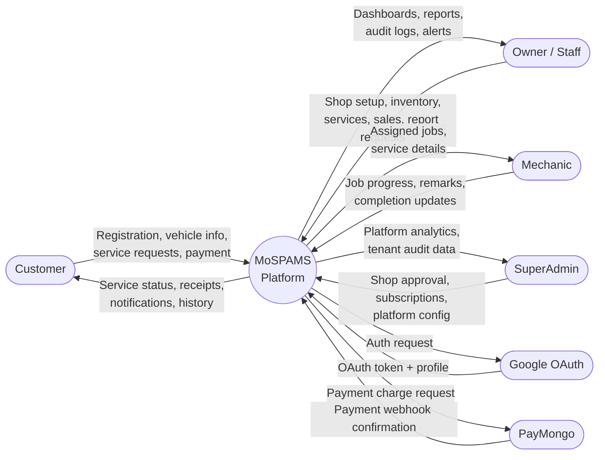
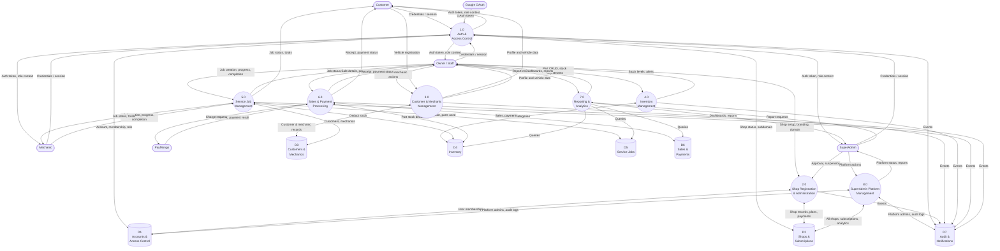
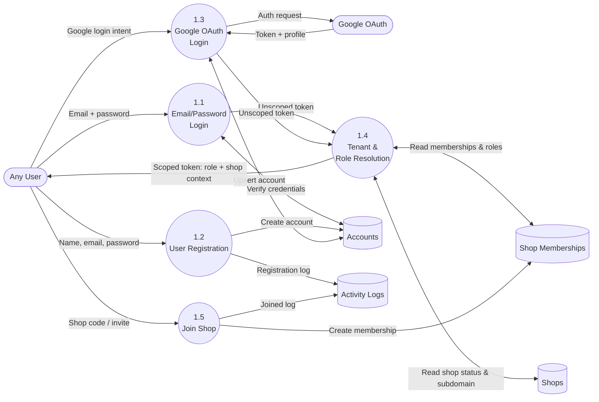
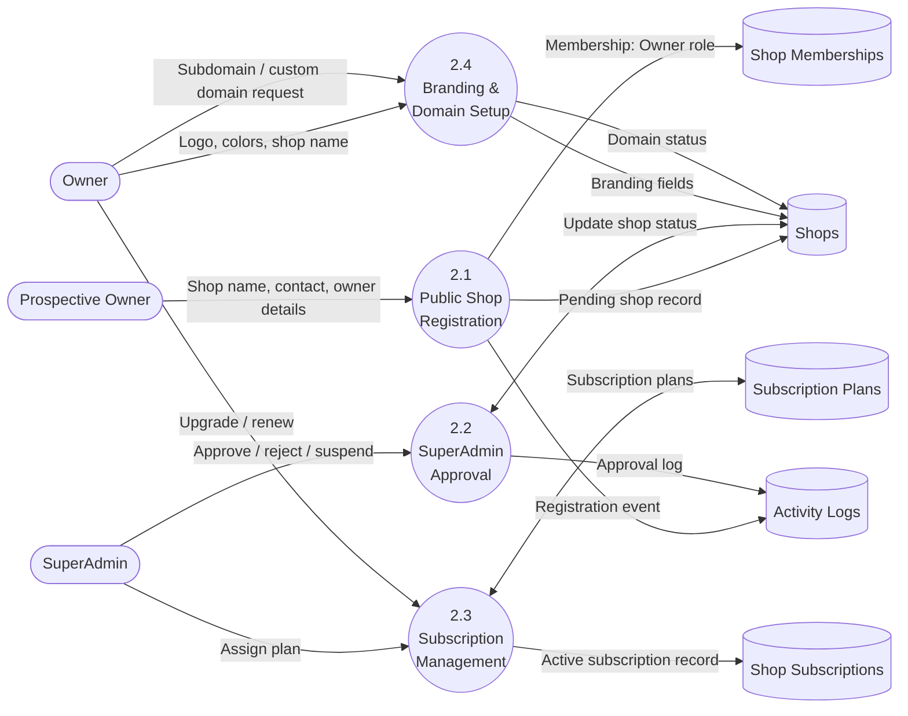
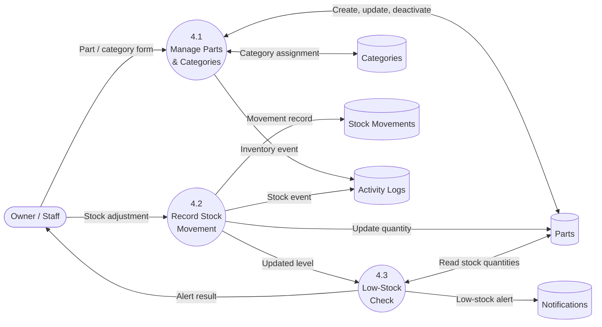
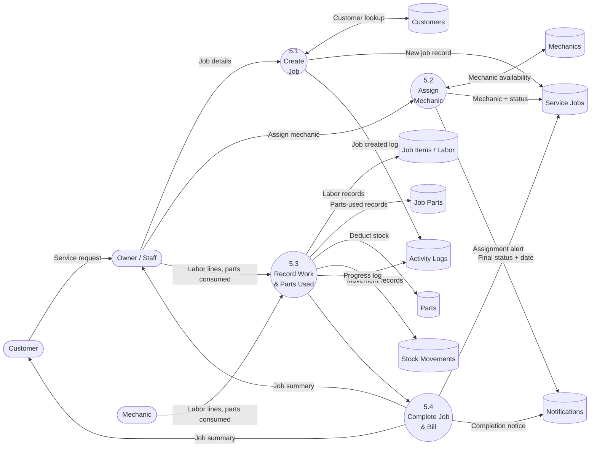
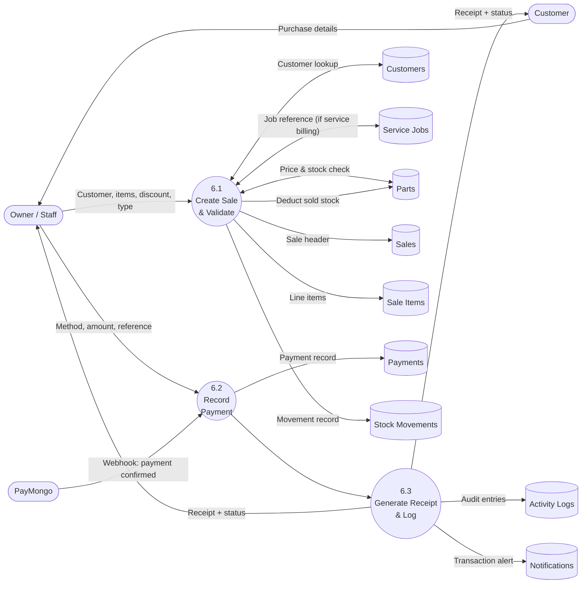
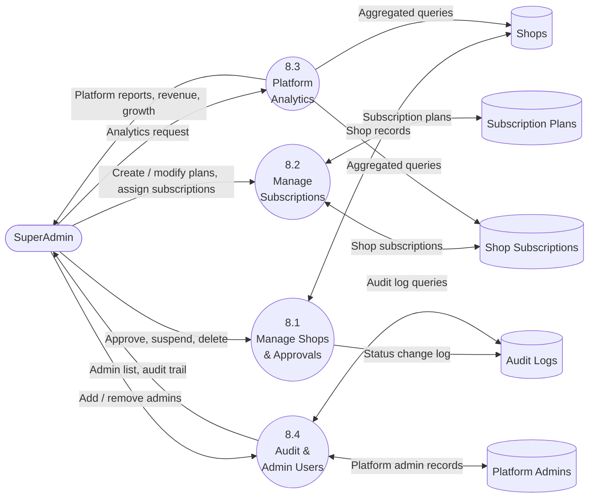

# MoSPAMS — Data Flow Diagram

> **System:** Motorcycle Service and Parts Management System (Multi-Tenant SaaS)
> **Stack:** React + TypeScript (Frontend) · Laravel (API) · MySQL (Database)
> **Generated from:** live codebase — routes, migrations, and feature modules

---

## Level 0 — Context Diagram

Highest-level view. Shows all external entities and what they send to and receive from the platform.

---

## Level 1 — Major Processes

Breaks the system into its eight major functional processes and the data stores they access.

---

## Level 2 — Authentication & Access Control

---

## Level 2 — Shop Registration & Administration

---

## Level 2 — Inventory Management

---

## Level 2 — Service Job Management

---

## Level 2 — Sales & Payment Processing

---

## Level 2 — SuperAdmin Platform Management

---

## Data Stores Reference

| ID | Store | Key Tables | Purpose |
|----|-------|-----------|---------|
| D1 | Accounts & Access Control | `accounts`, `shop_memberships`, `platform_admins`, `roles` | Identity, authentication, role-based access, tenant membership |
| D2 | Shops & Subscriptions | `shops`, `subscription_plans`, `shop_subscriptions`, `subscription_payments` | Multi-tenant shop records, billing tiers, domain config, branding |
| D3 | Customers & Mechanics | `customers`, `mechanics`, `customer_vehicles`, `mechanic_statuses` | Customer profiles, vehicles, mechanic records and availability |
| D4 | Inventory | `parts`, `categories`, `part_statuses`, `category_statuses` | Parts catalog, pricing, stock quantities, category classification |
| D5 | Service Jobs | `service_jobs`, `service_job_items`, `service_job_parts`, `service_types` | Job lifecycle, labor lines, parts consumed per job |
| D6 | Sales & Payments | `sales`, `sale_items`, `payments`, `payment_statuses` | Point-of-sale records, service billing, payment tracking |
| D7 | Audit & Notifications | `activity_logs`, `notifications`, `tenant_audit_events` | System-wide audit trail and user-facing alerts |
| D4/SM | Stock Movements | `stock_movements` | Inventory audit trail — all quantity changes with references |

---

## External Entities Reference

| Entity | Sends to System | Receives from System |
|--------|----------------|---------------------|
| Customer | Registration, vehicle info, service requests, payments | Service status, receipts, notifications, history |
| Owner / Staff | Shop config, inventory, services, sales, report requests | Dashboards, reports, records, alerts, audit logs |
| Mechanic | Job progress, remarks, completion updates | Assigned jobs, customer/service details, notifications |
| SuperAdmin | Shop approvals, plan management, platform actions | Platform analytics, tenant audit data, revenue reports |
| Google OAuth | OAuth token + Google profile | Auth redirect request |
| PayMongo | Payment webhook (confirmed / failed) | Payment charge request |

---

## Key Data Flow Rules

1. **Tenant isolation** — Every shop-scoped query is filtered by `shop_id` resolved from the authenticated session's subdomain or JWT context. Cross-tenant access is blocked at middleware.
2. **Role enforcement** — Owner, Staff, Mechanic, and Customer roles are enforced per route via Laravel policies. SuperAdmin and Platform Admin bypass shop-scope checks.
3. **Stock double-write** — Every stock change writes to both `parts.stock_quantity` (current level) and `stock_movements` (audit trail with user and reference).
4. **Payment webhook** — PayMongo posts a signed webhook to the platform; payments are only marked `paid` after webhook verification, not on frontend confirmation.
5. **Google OAuth upsert** — Login via Google creates the account if it does not exist, or links the Google ID to an existing account matched by email.
6. **Notifications** — Low-stock, mechanic assignment, job completion, subscription changes, and payment events all produce `notifications` records for the relevant user.
7. **SuperAdmin scope** — SuperAdmin operates above all tenant boundaries and can access platform-wide analytics, all shop records, and subscription data.
